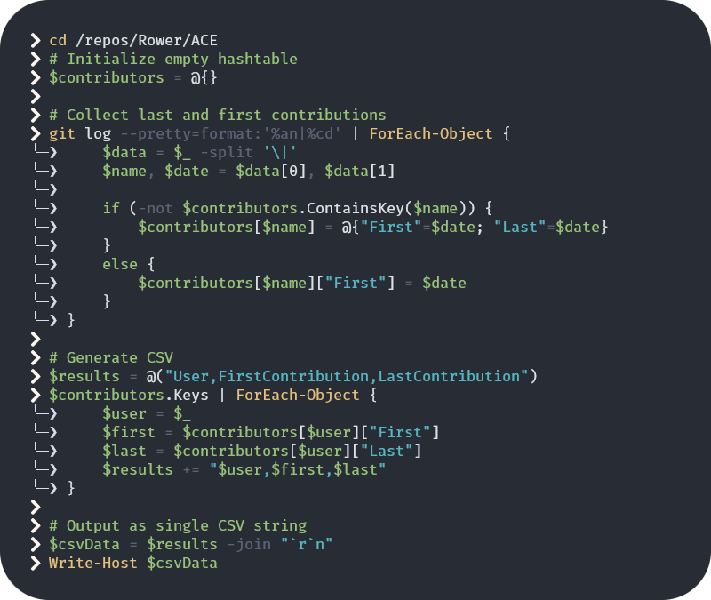
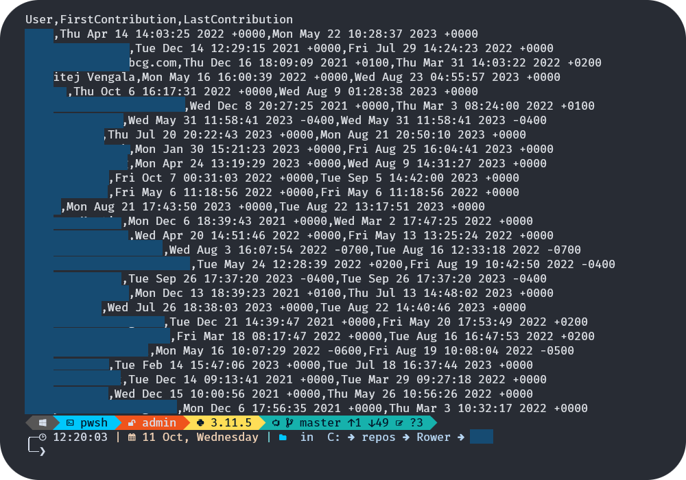
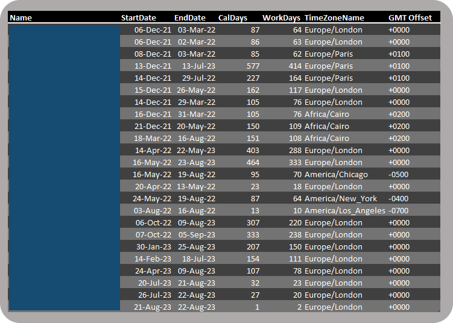
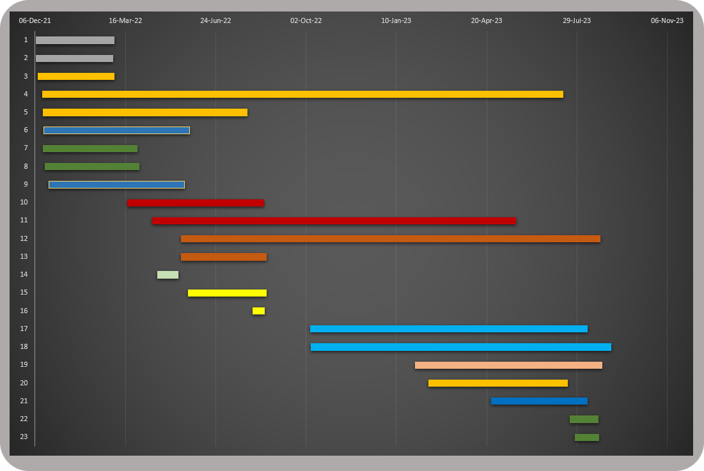

# PowerShell based git log helper script

When reviewing repositories for activity it's often useful to get a picture of what's happening in the code by looking at it directly. There's more than one way to do this - particularly with all of the process management tools that sit "on top" of git. 

However we like to go to "the source" as often as we can, and this little helper script does that for us. Since git is the defacto repository we don't have to worry about various "paper cuts" in trying to get this information out of the higher-level management tool. 

## The script

The PowerShell script in this repo (git-log.ps1) fetches the first and last date of activity for each user in a repo. It both outputs the info to the console as well as writes it to a file for import into other tools.

## The output

There are some wrinkles to this, some of which stems from the variety of ways that tools like Azure DevOps, Atlassian Jira integration or other "wrinkles" can cause things to go a bit askew in git. In our case we saw the same person showing up with multiple "handles" - either an email address or a version of the person's proper name. We didn't try to do too much with the data at this point - we just wanted to get a general overall view of how many actors and how much staff rotation might have occurred over the life of the project.

## Bringing in the data

In fine Excel "tradition" there was some hand-jamming of the data in order to get certain data out of it. There were some questions about the time zone/locales that users were showing as contributing. But after we realized that we hadn't compensated for Daylight Saving Time we left that portion of analysis "off the table" as it wasn't really central to what we were revewing in the life of the code.

## The Gantt chart

The actual goal was to have a visual representation of who had contributed in what windows of time. The script didn't account for the number of check-ins - and we were intentionally avoiding that potentially false indicator. We really just wanted to see the overall range of contributors and how often "the seats changed". 

This chart uses a well-known hack of Excel's stacked bar chart, where we added color distinction for each user "in the mix". So if we had a "User Name" on one line and then another `user.name@company.com` we did our best to line them up next to each other so it's a bit easier on the eye. 

## A springboard for more 

It's certainly possible to gain more info from this process, both in creating more interesting "git log" queries as well as streamlining the processing of the resulting data. But this was a quick way for us to get an overview of how the project developed over time as we entered the picture nearly two years into the application's lifetime.